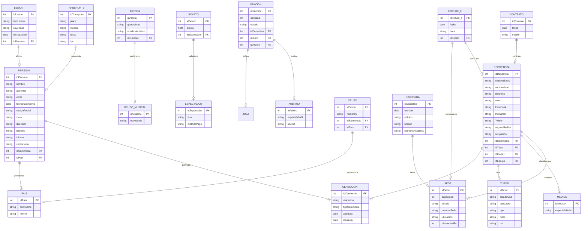

# proyectoBD

```mermaid
erDiagram
    %% ENTIDADES PRINCIPALES
    SANCION {
        int idSancion PK
        int cantidad
        string estado
        int idDeportista FK
        int idJuez FK
        int idArbitro FK
    }

    PERSONA {
        int idPersona PK
        string nombre
        string apellidos
        string email
        date fechaNacimiento
        string codigoPostal
        string zona
        string direccion
        string telefono
        string idioma
        string contrasena
        int idCeremonia FK
        int idPais FK
    }

    PAIS {
        int idPais PK
        string continente
        string himno
    }

    CEREMONIA {
        int idCeremonia PK
        string ubicacion
        string tipoCeremonia
        date apertura
        date clausura
    }

    ARBITRO {
        int idArbitro PK
        string especialidadA
        string idioma
    }

    TUTOR {
        int idTutor PK
        string estadoCivil
        string ocupacion
        string tipo
        string rutas
        string rut
    }

    LESION {
        int idLesion PK
        string tipoLesion
        string severidad
        date fechaLesion
        int idPersona FK
    }

    MEDICO {
        int idMedico PK
        string especialidadM
    }

    ARTISTA {
        int idArtista PK
        string generoMus
        string nombreArtistico
        int idGrupoM FK
    }

    GRUPO_MUSICAL {
        int idGrupoM PK
        string trayectoria
    }

    ESPECTADOR {
        int idEspectador PK
        string tipo
        string metodoPago
    }

    BOLETO {
        int idBoleto PK
        float precio
        int idEspectador FK
    }

    DEPORTISTA {
        int idDeportista PK
        string sistemaSalud
        string nacionalidad
        string biografia
        string sexo
        string Facebook
        string Instagram
        string Twitter
        string seguroMedico
        string ocupacion
        int idCeremonia FK
        int idTutor FK
        int idMedico FK
        int idEquipo FK
    }

    GRUPO {
        int idGrupo PK
        string nombreG
        int idBaloncesto FK
        int idPais FK
    }

    SEDE {
        int idSede PK
        int capacidad
        string estado
        string nombreSede
        string ubicacion
        int distanciaVilla
    }

    DISCIPLINA {
        int idDisciplina PK
        date fechaIni
        string edicion
        string horario
        string nombreDisciplina
    }

    FIXTURE_F {
        int idFixture_F PK
        date fecha
        string hora
        int idFutbol FK
    }

    TRANSPORTE {
        int idTransporte PK
        string placa
        string modelo
        string rutas
        string tipo
    }

    CONTRATO {
        int idContrato PK
        date fecha
        string detalle
    }

    %% RELACIONES ENTRE ENTIDADES
    PERSONA ||--o{ PAIS : "pertenece"
    PERSONA ||--o| CEREMONIA : "participa"
    LESION ||--o| PERSONA : "afecta"
    ARTISTA ||--o| GRUPO_MUSICAL : "pertenece"
    BOLETO ||--o| ESPECTADOR : "adquiere"
    DEPORTISTA ||--o| CEREMONIA : "asiste"
    DEPORTISTA ||--o| TUTOR : "tutor"
    DEPORTISTA ||--o| MEDICO : "atendido por"
    DEPORTISTA ||--o| SEDE : "compite"
    FIXTURE_F ||--o| SEDE : "se juega en"
    TRANSPORTE ||--o| PERSONA : "transporta"
    SANCION ||--o| JUEZ : "aplica"
    SANCION ||--o| ARBITRO : "evalua"
    DISCIPLINA ||--o| SEDE : "tiene"
    CONTRATO ||--o| DEPORTISTA : "contrata"
    GRUPO ||--o| PAIS : "representa"
    FIXTURE_F ||--o| DEPORTISTA : "participa"

```
