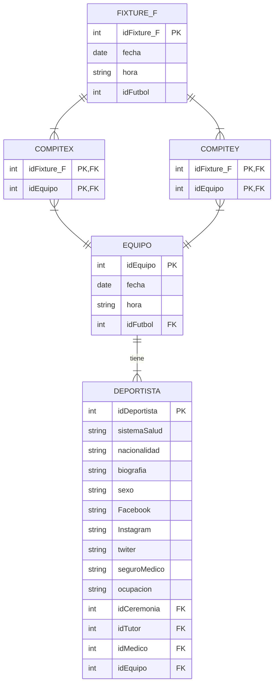

```mermaid
erDiagram
    FIXTURE_F {
        int idFixture_F PK
        date fecha
        string hora
        int idFutbol
    }
        DEPORTISTA {
        int idDeportista PK
        string sistemaSalud
        string nacionalidad
        string biografia
        string sexo
        string Facebook
        string Instagram
        string twiter
        string seguroMedico
        string ocupacion
        int idCeremonia FK
        int idTutor FK
        int idMedico FK
        int idEquipo FK
    }  
    EQUIPO {
        int idEquipo PK
        date fecha
        string hora
        int idFutbol FK
    }
    COMPITEX {
        int idFixture_F PK,FK
        int idEquipo PK,FK
    }
    COMPITEY {
        int idFixture_F PK,FK
        int idEquipo PK,FK
    }
    EQUIPO ||--|{DEPORTISTA :"tiene"
    COMPITEX }|--||EQUIPO :""
    COMPITEY }|--||EQUIPO :""
    FIXTURE_F ||--|{COMPITEX :""
    FIXTURE_F ||--|{COMPITEY :""


```