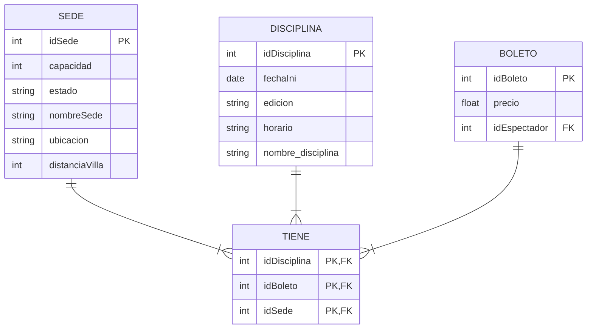

```mermaid
erDiagram
    BOLETO {
        int idBoleto PK
        float precio
        int idEspectador FK
    }
    TIENE {
        int idDisciplina PK,FK
        int idBoleto PK,FK
        int idSede PK,FK
    }
    DISCIPLINA {
        int idDisciplina PK
        date fechaIni
        string edicion
        string horario
        string nombre_disciplina
    }
    SEDE {
        int idSede PK
        int capacidad
        string estado
        string nombreSede
        string ubicacion
        int distanciaVilla
    }

    SEDE ||--|{ TIENE : ""
    DISCIPLINA ||--|{ TIENE :""
    BOLETO ||--|{ TIENE :""

```