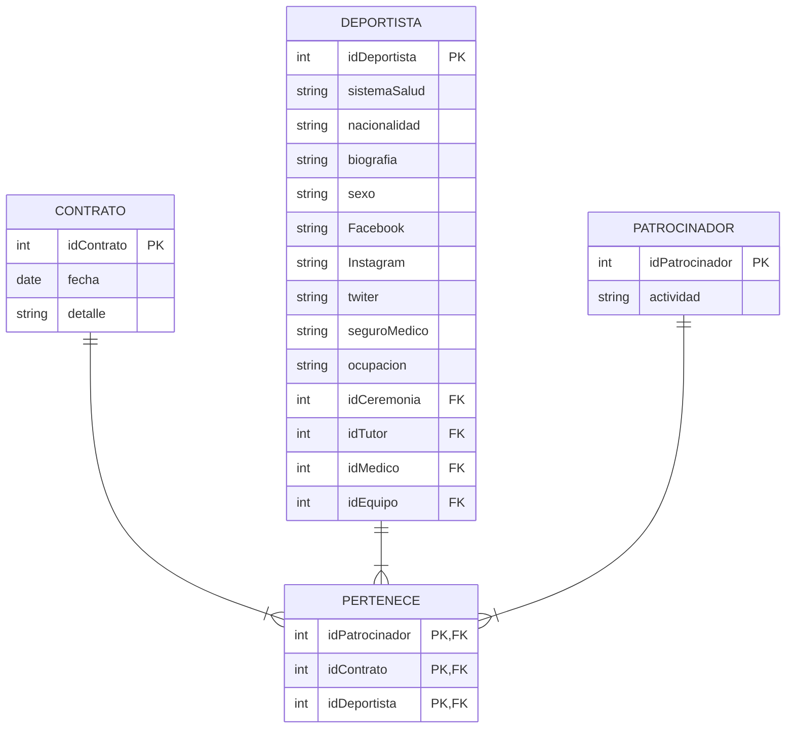

```mermaid
erDiagram
    PERTENECE {
        int idPatrocinador PK,FK
        int idContrato PK,FK
        int idDeportista PK,FK
    }
    PATROCINADOR {
        int idPatrocinador PK
        string actividad
    }
        DEPORTISTA {
        int idDeportista PK
        string sistemaSalud
        string nacionalidad
        string biografia
        string sexo
        string Facebook
        string Instagram
        string twiter
        string seguroMedico
        string ocupacion
        int idCeremonia FK
        int idTutor FK
        int idMedico FK
        int idEquipo FK
    }  
    CONTRATO {
        int idContrato PK
        date fecha
        string detalle
    }


    CONTRATO ||--|{ PERTENECE :""
    DEPORTISTA ||--|{ PERTENECE :""
    PATROCINADOR ||--|{ PERTENECE :""
    
```