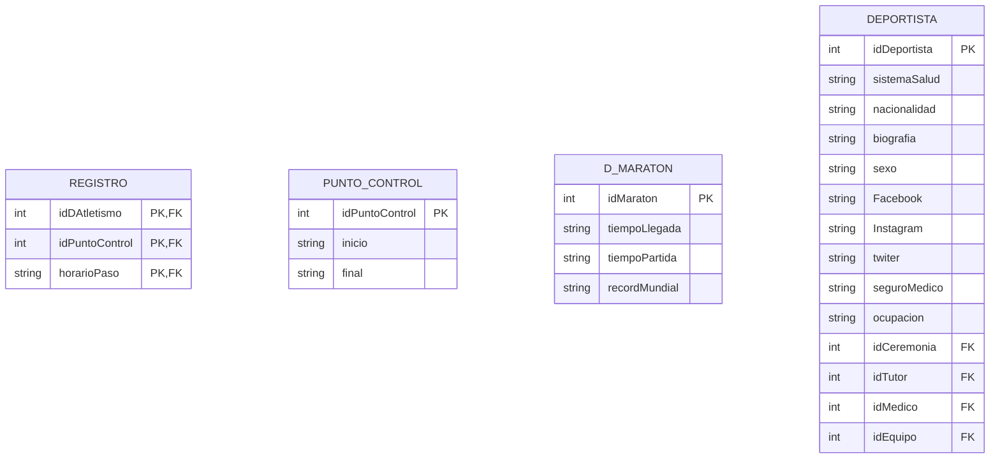

```mermaid
erDiagram
    REGISTRO {
        int idDAtletismo PK,FK
        int idPuntoControl PK,FK
        string horarioPaso PK,FK
    }
    PUNTO_CONTROL {
        int idPuntoControl PK
        string inicio
        string final
    }
    D_MARATON {
        int idMaraton PK
        string tiempoLlegada
        string tiempoPartida
        string recordMundial
    }
    DEPORTISTA {
        int idDeportista PK
        string sistemaSalud
        string nacionalidad
        string biografia
        string sexo
        string Facebook
        string Instagram
        string twiter
        string seguroMedico
        string ocupacion
        int idCeremonia FK
        int idTutor FK
        int idMedico FK
        int idEquipo FK
    }  
```